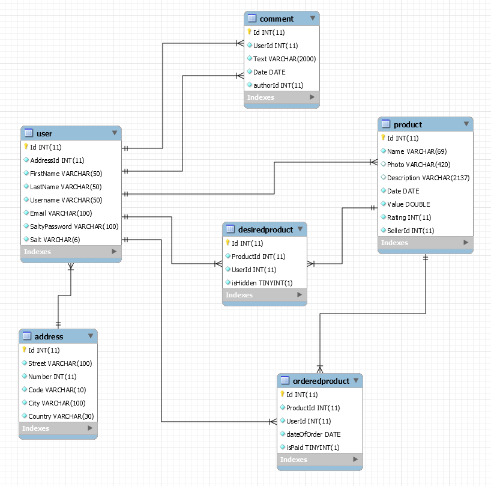

## Technologia
W projekcie bedziemy używać django, które będzie obsługiwało backend strony internetowej, pisanej w HTML5 oraz bootstrapie.
Dodatkowo hasła będą haszowane i wysyłane w stronę serwera uzywając algorytmu szyfrującego (jeszcze nie zdecydowane który).

## Diagram

## Rozważania wielkości
Wielkość każdej z rozwazanych tabel, należy rozważać według założeń biznesowych. W nasyzm wypadku rozważamy mały; maksymalnie średni sklep internetowy oferujący usługi aukcyjne.
### User
Czeste modyfikacje (Głównie hasła), możliwośc usunięcia

Ilość uzytkowników zakłdana dla średnego sklepu to do 100 tys. osób. Należy oczekiwać, że każda osoba kupująca w naszym sklepie musi posiadać założone konto oraz, że większość klientów będzie aktywna raz na miesiąc. Podczas gdy nie jest to istotne w fazie planowania bazy danych, pozwala to na przewidzenie ilości osób prowadzących równoloegle zakupy.
### Address
Brak modyfikacji, stała obecnośc

Ilość addresów będzie mniejszy od ilości uzytkowników, ponieważ wiele osób zamawia z jednego ddomu (rodziny), lub zamawia na firmę (dowóz do firmy),co pozwoli nam zmniejszyć ilośc danych przechowywanych naraz w firmie.  
### Product
Duża ilośc modyfikacji, nie usuwamy.

Ilość produktów zalezy od użytkowników, jednak będzie ich prawdopodobnie od 0 do 6 prodóktów na osobę, ponieważ wiele sztuk jednego produktu będzie przechowywane wewnątrz jednego egzemplarza (_Amount_). Oczywiście niesie to ze sobą dużą wadę - jeżeli uzytkownik sprzedaje różny typy jednego produktu, np klasa A, B, C, to będzie trzeba utworzyć nową aukcje. Tak więc zakładam że będziemy mieli średnio 600 tys. produktów naraz. (W momencie osiągnięcia 100 tys. użytkowników. W przeciwnym wypadku, należy przewidywać `UserCount*6`).
### Product List
Duża ilość modyfikacji, nie usuwamy.

Można przewidywać ze każdy użytkownik, wytworzy w ciągu roku po 10, może nawet 12 list.
### Ordered Product
Duza ilość, często dodawane, żadko modyfikowane.

Ciężko przewidzieć, ale przeważnie będzie to wachało się pomiędzy 1 do 30 dla jednego użytkownika na zakupy. Tak więc max `30 * 12 * maxUsers` rocznie.
### Desired Product
Duza ilość, często dodawane, żadko modyfikowane.

Funkcjonalność listy życzeń jest uważana za najmniej używaną funkcjonalność stron internetowych jednak jeśli już jest używna, jestu zywana w pełni. tak więc ilośc elementów per użytkownik, będzie wynosiła od 30 do 100 elemntów, gdzie używac tego będzie jedna osoba na tysiąc, tak więc (`maxUsers/1000 * 100`)
### Comment
Często modyfikowane, czesto dodawane, usuwane

Jeden produkt posiada przeważnie od 1 do 30 komentarzy, tak więc `maxProducts * 30`

### Potencjalne transakcje

Usunięcie listy, bedzie prowadziło do uruchomienia triggera, który usunie wszystkie Produkty (desired/ordered) z tabel, aby nie miały wiszących referencji, tak samo usunięcie produktu, doprowadzi do usunięcia produktu z listy ordered/desired. Dodatkowo, zakończenie operacji zapłatą, doprowadzi do dekrementacji ilości puli produktów bazowych (sprawdzanie ilości produktów +0, jest z poziomu software'u).
