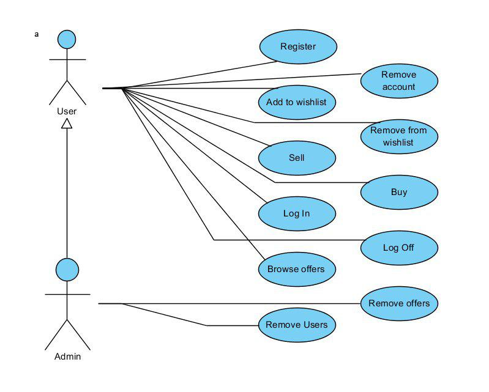

## **Bazy danych 2**
**Prowadzacy**:  
Jarosław Rudy

**Wykonawcy**:  
Ormaniec Wojciech  
Rodziewicz Bartosz

**Daty oddania**:  
10/24/2017

**Opis "świata rzeczywistego"**:

Klienci dzielą się na dwie grupy:
* kupujący
* sprzedający

Kupującym jest każdy klient. Sprzedającym może stać się każdy, jednak musi to aktywować w ustawieniach.

Aby stać się klientem trzeba się zarejestrować w systemie.

Kupujący może:
* przeglądać oferty sprzedaży,
* kupować produkty,
* dodawać i usuwać produkty do/z listy na później (wishlist),
* edytować swoje ustawienia (zmiana hasła, itd.).

Sprzedający dodatkowo może:
* wystawiać produkty na sprzedaż.
